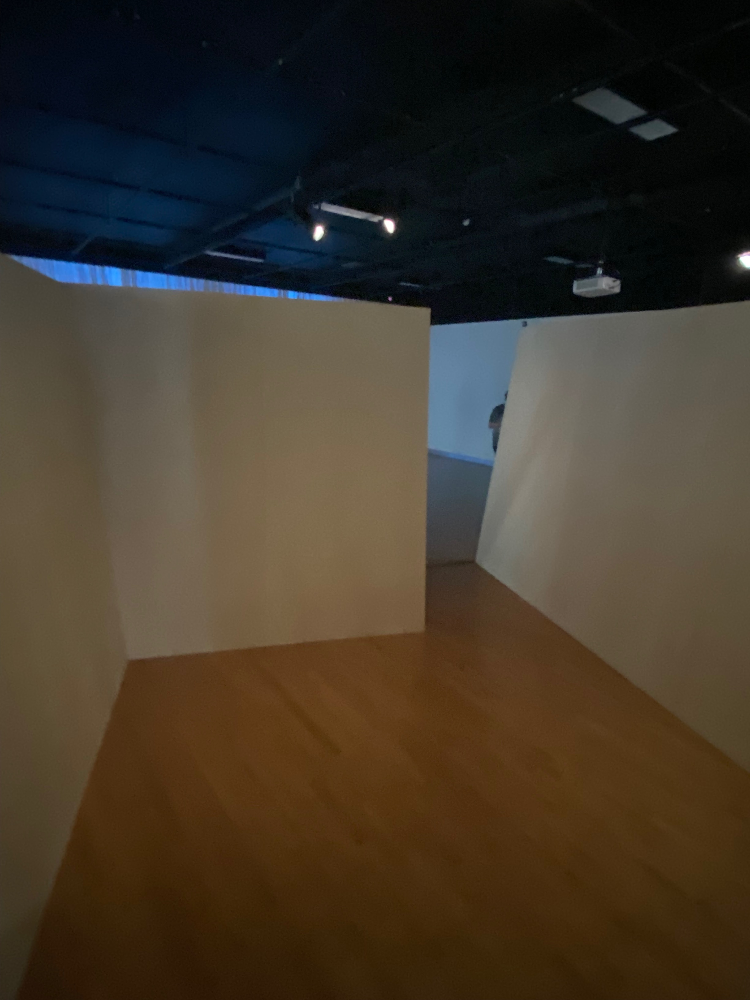
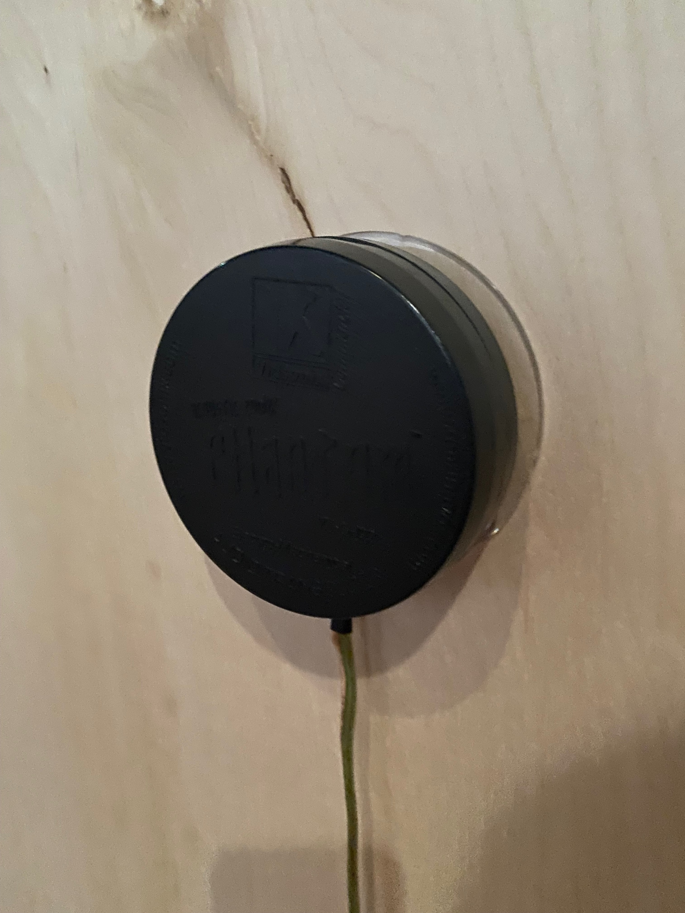
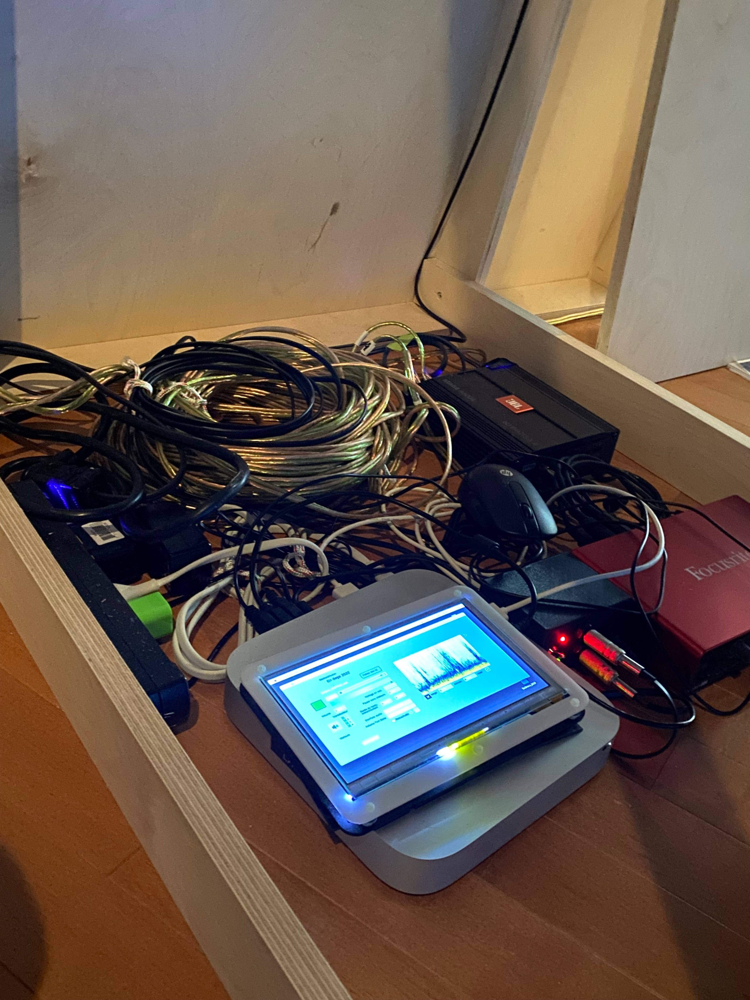
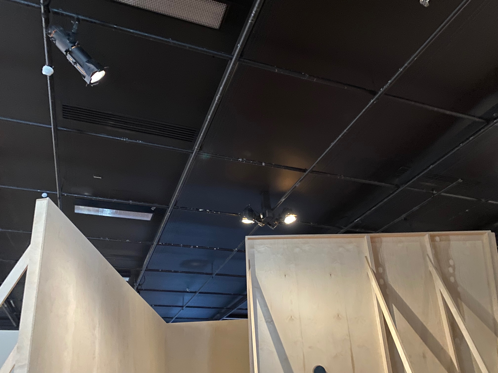
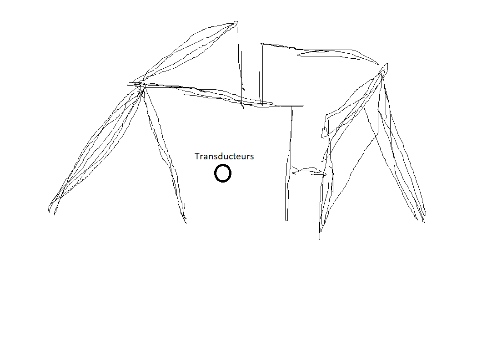

 ### Titre de l'oeuvre ou de la réalisation
 
 * Mécanismes de dessaisissement
 * L'en deçà
 
 ### Nom de l'artiste ou de la firme
 
 Béchard Hudon

 ### Année de réalisation
 
 20 février au 16 avril 2022

 ### Nom de l'exposition ou de l'événement
 
 Configurations du sensible

 ### Lieu de mise en exposition
 
 Présentée à la salle Alfred-Pellan

 ### Date de votre visite
 
 24 mars 2022

 ### Description de l'oeuvre ou du dispositif multimédia (à composer ou reprendre la description offerte sur le site de l'artiste ou le cartel de l'exposition en citant bien sa source)
 
C'est sur le vaste territoire compris entre Sept-Îles et Kegaska, sur la Côte-Nord que furent captés les paysages sonores singuliers au coeur de cette oeuvre. L'usage d'hydrophones, soit des des micros pouvant enregistrer sous l'eau, ainsi que de géophones spécialement concus par les artistes pour capter les vibrations du sol et les traduire en sons, fut essentiel au projet. Diffusée via des transducteurs - qui ici transforment les parois de bois en membranes de transmission sonore-, la composition qui découle de ces enregistrements permet d'entendre une faune marine complexe, notament une colonie d'oursins, et des ondes terrestres en bordure du Saint-Laurent, mais aussi des sons quie ni les artistes, ni les pêcheurs, ni d'autres habitants rencontrés dans la région ne furent capables d'identifier avec précision. Cette part de mystère est soutenue par les détecteurs de mouvement qui activent la bande-son, avec des moments de silence lorsque les gestes se font absents. Le mode d'attention particulier que ces silences convoquent fait partie intégrante de l'oeuvre; il s'agit d'un motif que le duo traite de longue date.

source: description sur papier
 
source:https://www.laval.ca/Pages/Fr/Calendrier/mda-expo-bechard-hudon.aspx#:~:text=Depuis%20plus%20de,grandes%20divisions%20binaires.

### Explications sur la mise en espace de l'oeuvre ou du dispositif 
 
En rentrant dans la salle, on nous invitait tout de suite à rentrer dans la boite en bois qui s'appelle ''L'en deca''. 

 
 

À l'intérieure on entendait des sons qui ont été enregistrer que même l'humain de peux pas entendre sans l'aide d'une machine. Il y avait des vibrations sur les murs transmits par des transducteurs:

J'avais l'impressions d'être sous l'eau comme si j'étais enfoui dans un de mes plus profonds souvenirs d'enfance. J'étais très confortable, je me couchais dans un des coins et un sentiment de confort me submergeas.
 
### Liste des composantes et techniques de l'oeuvre ou du dispositif 

* projecteurs
* transducteurs
* spotlights

### Liste des éléments nécessaires pour la mise en exposition (ex. : crochets, sac de sable, câbles de soutien...)

* boite en bois pour cacher les fils de L'en deça:

* 

### Expérience vécue :

Mon expérience à cette exposition fut très agréable. J'ai bien aimer la boite en bois puisqu'elle me mettait dans une position de confort total avec les bruits qui nous étions inconnue et aussi les vibrations me donnait un sentiment de réconfort quand j'étais à l'intérieur coucher contre un mur. Ensuite, les trois oeuvres était très intéressantes aussi. J'ai beaucoup aimé qu'ils était toutes différentes, mais aussi toutes similaire à la fois. Chacuns avec sa forme et sa couleur, mais en passant au dela de ca il y avait une unité entre eux.

### Description de votre expérience de l'oeuvre ou du dispositif, de l'interactivité, des gestes à poser, etc.

 ❤️ J'ai beaucoup apprécier les trois oeuvres de formes puisque cela ma appris que nous ne sommes pas obliger de toujours cacher les fils pour que cela sois beau.

 🤔 Je peux sincèrement dire que j'ai appris beaucoup de choses de cette exposition et que je ne trouve pas autre informations qui ne ma pas fait grandir à travers cette expérience miraculeuse.

 Références

Photographies et croquis à intégrer

 photographie de l'oeuvre ou du dispositif dans son ensemble:
 
 
 
 photographies des composantes de l'oeuvre:
 
 
 photographies des éléments nécessaires à sa mise en espace
 
 photographie du cartel ou du panneau explicatif
 
 autoportrait (photo) de vous avec l'oeuvre
 
 croquis de la mise en espace (choisir la vue la plus pertinente : plan ou élévation)
 
