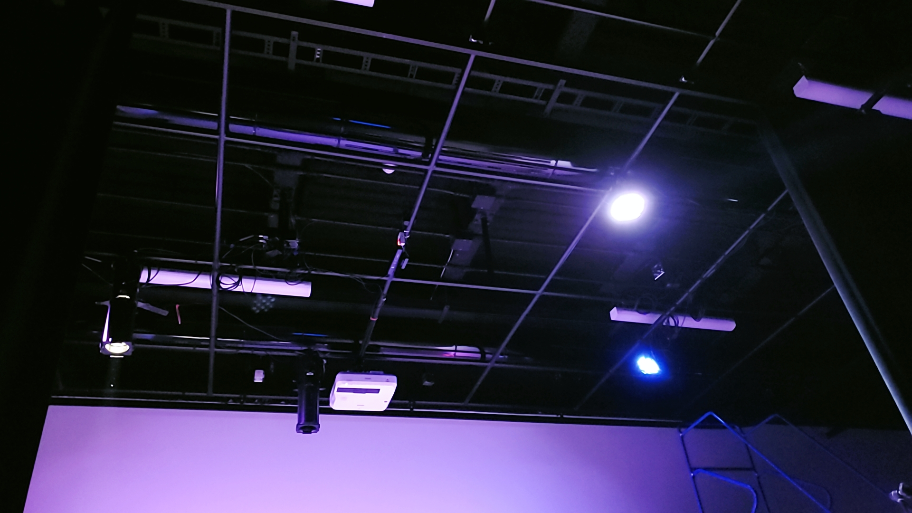
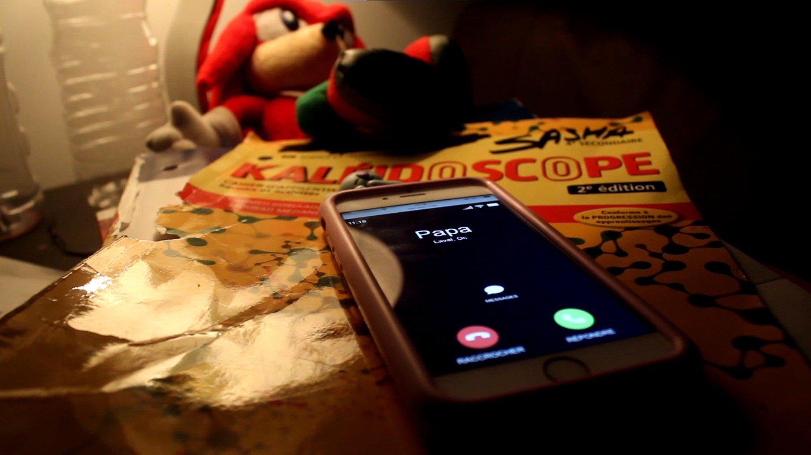
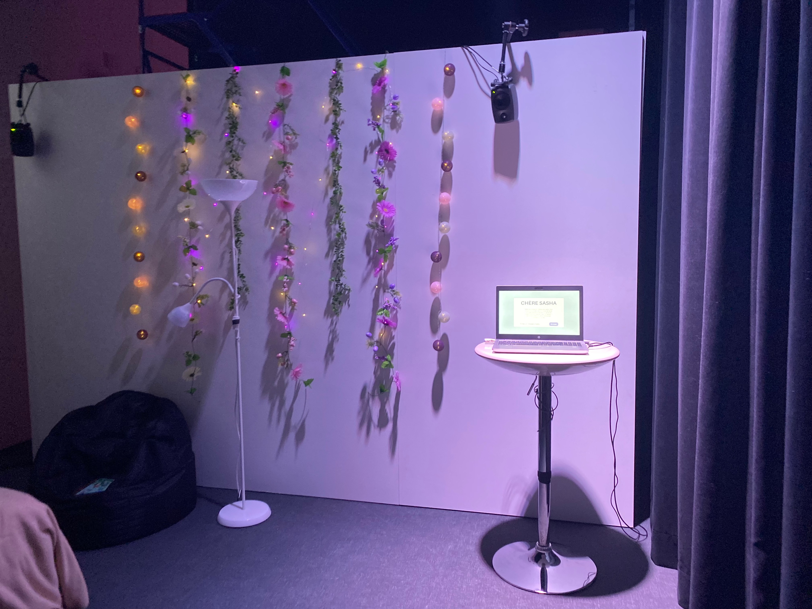
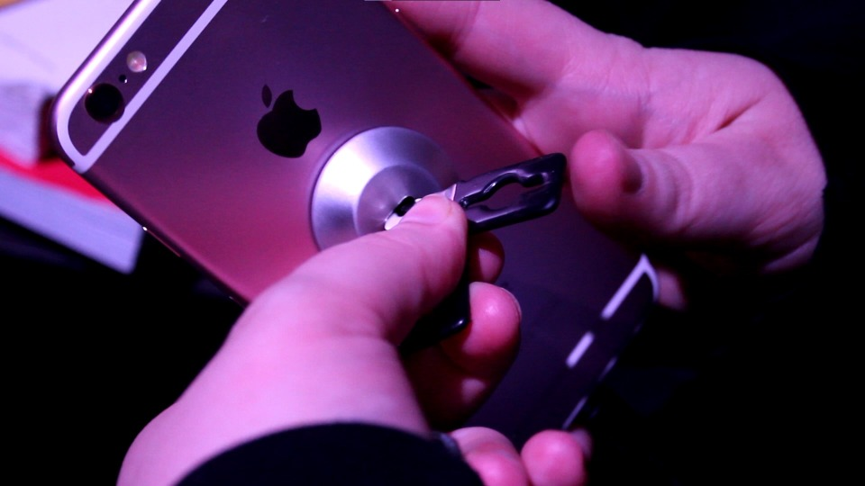

### Titre de l'oeuvre ou de la réalisation:

Chère Sasha

### Nom de l'artiste ou de la firme:

Trish Nguyen, Angelina De Silva Jeca, Karine Cormier et Sabrina Kayani

### Année de réalisation:

2022

### Nom de l'exposition ou de l'événement:

Chère Sasha

### Lieu de mise en exposition:

Collège Montmorency au grand studio

### Date de votre visite:

24 mars 2022

### Description de l'oeuvre ou du dispositif multimédia:

Sasha adolescente et Sasha adulte vivent leur vie. Durant son adolescence, Sasha se fait négliger par ses parents et cela affecte sa santé mentale. Pendant sa vie d'adulte, Sasha habite maintenant seule, Sasha s'accepte, mais ses parents sont toujours contre elle. Cependant, Sasha se porte mieux mentalement qu'avant. Le public est appelé à découvrir que les deux vies projetées devant eux sont différents passages de la vie d'une seule et même personne.

source: https://tim-montmorency.com/2022/projets/Chere-Sasha/docs/web/index.html

### Explications sur la mise en espace de l'oeuvre ou du dispositif (texte à composer)

La mise en espaces était très 

### Liste des composantes et techniques de l'oeuvre ou du dispositif (ex. : réalité virtuelle, projecteurs, caméra USB, anneau lumineux...)

* projecteur

source: https://tim-montmorency.com/2022/projets/Chere-Sasha/docs/web/index.html
* téléphone 

source: https://tim-montmorency.com/2022/projets/Chere-Sasha/docs/web/index.html
* ordinateur

### Liste des éléments nécessaires pour la mise en exposition (ex. : crochets, sac de sable, câbles de soutien...)

* sécurité pour le téléphone

source: https://tim-montmorency.com/2022/projets/Chere-Sasha/docs/web/index.html

Expérience vécue :

### Description de votre expérience de l'oeuvre ou du dispositif, de l'interactivité, des gestes à poser, etc.

❤️ Ce qui vous a plu, vous a donné des idées et justifications:

Ce qui ma beaucoup plus dans l'oeuvre ''Chère Sasha'' c'est que c'était très visé à ma génération et donc j'ai pus comprendre et sympathiser avec Sasha, car le relations qu'elle entreprenait avec son père me rappel beaucoup la mienne. Donc, cela me donne beaucoup d'espoir à voir que les choses vont de mieux en mieux en grandissant et qu'il ne faut pas rester dans l'ombre caché mais bien sortir et vivre la vie à pleine dents. De plus, à la fin nous pouvions écrire des petits mots pour qu'il puisse s'ajouter au mur de projection parmis tout les autres. Cela me donnait un ressentit d'unité et de comprésension.

🤔 Aspect que vous ne souhaiteriez pas retenir pour vos propres créations ou que vous feriez autrement et justifications:

La seule chose que j'aurais fait autrement serait peut etre de changer le titre de l'oeuvre, puisque c'est un peux compliquer de le prononcer à voix haute. Appart cela, je suis très jalouse de ne pa pouvoir faire se projet dans ma future dernière année de ma technique, parce que c'est une très bonne idée.

Références

Photographies et croquis à intégrer

photographie de l'oeuvre ou du dispositif dans son ensemble photographies des composantes de l'oeuvre photographies des éléments nécessaires à sa mise en espace photographie du cartel ou du panneau explicatif autoportrait (photo) de vous avec l'oeuvre croquis de la mise en espace (choisir la vue la plus pertinente : plan ou élévation) possibilité d'intégrer de courts vidéos pour documenter les actions de l'oeuvre ou l'interactivité avec celle-ci Organisation du repository
