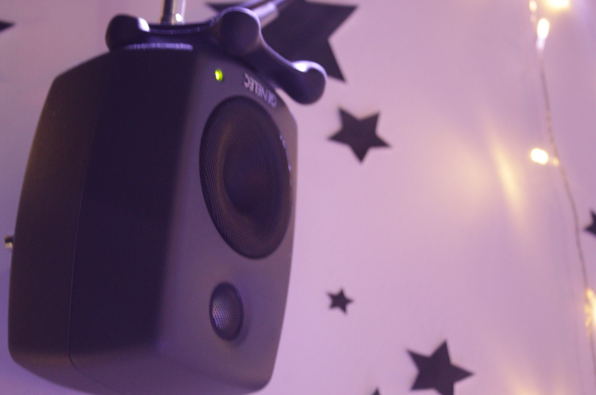
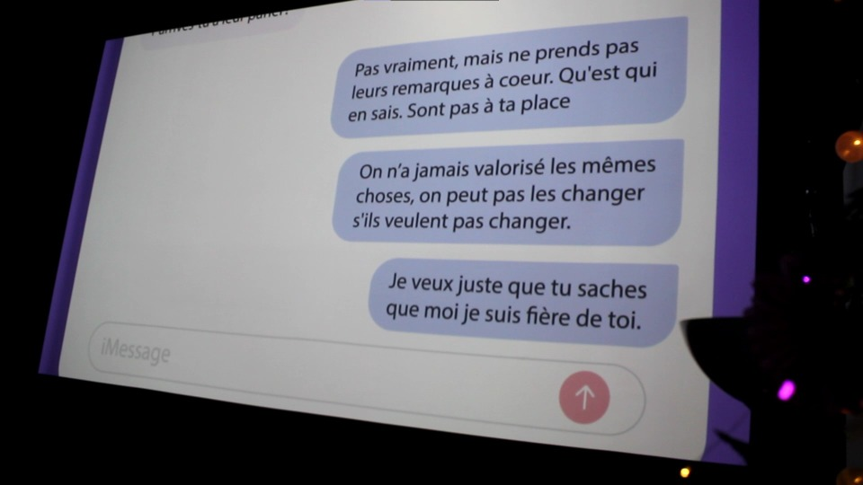
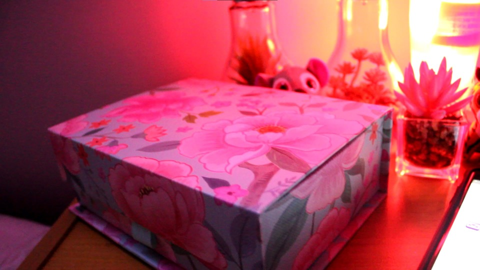
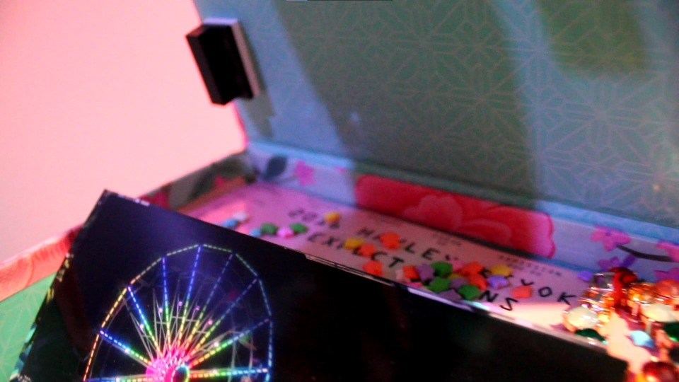
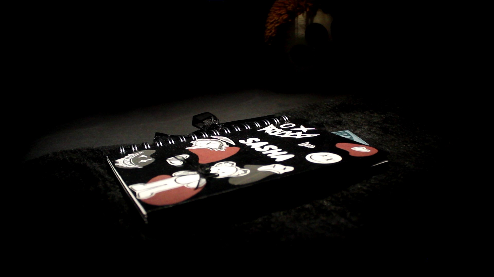
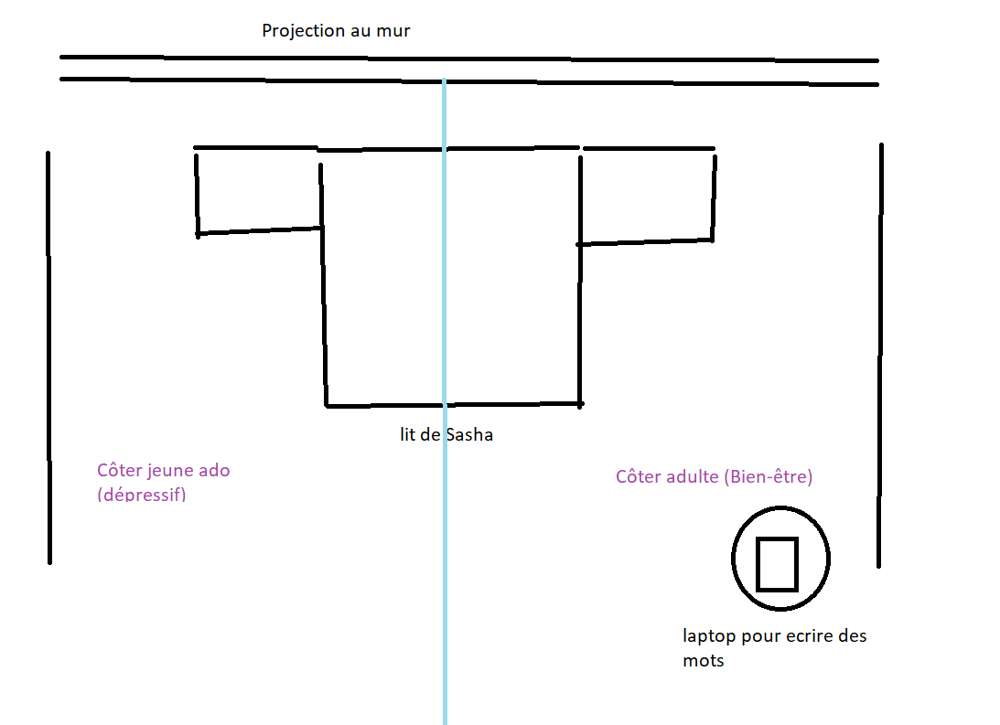

### Titre de l'oeuvre ou de la réalisation:

Chère Sasha

### Nom de l'artiste ou de la firme:

Trish Nguyen, Angelina De Silva Jeca, Karine Cormier et Sabrina Kayani

### Année de réalisation:

2022

### Nom de l'exposition ou de l'événement:

Chère Sasha

### Lieu de mise en exposition:

Collège Montmorency au grand studio

### Date de votre visite:

24 mars 2022

### Liste des Oeuvres de celui que j'ai plus aimé au moins:

* Chère Sasha : Au début je croyais que Chère Sasha allait être beaucoup plus bas dans ma liste, mais après la visite j'ai beaucoup apprécié l'approche qu'il ont eu de faire des deux côtés de la chambre. Je me sentais un peu comme dans une chambre ''escape room''.
* L'horloge de l'apocalypse : Au tout début quand j'ai entendu parler de ce projet je savais que j'allais l'aimer et effectivement j'ai beaucoup aimé le résultat final.
* Chronaufrage : J'ai beaucoup apprécié l'interactivité avec les dessins. C'était une bonne introduction au autre projet, dès que nous avions rentré dans le grand studio
* Jeu temporel : J'ai eu beaucoup de plaisir avec lui aussi puisqu' il y avait différentes fin au jeux. Je me suis donc mis comme défi de voir ce que c'était quand tu avais toutes les bonnes réponses. 
* 3 minutes : Lui aussi je l'ai aimé, mais un peu moins que les autres puisque les transition était un peu sec et quand tout changeait vite cela me stressait un peu.
* Distorsion collective : Et finalement, j'ai moins aimé celui-ci, mais purement pour des raisons personnelles et non pour des raisons artistiques. Cela me faisait penser à mon primaire.

### Description de l'oeuvre ou du dispositif multimédia:

Sasha adolescente et Sasha adulte vivent leur vie. Durant son adolescence, Sasha se fait négliger par ses parents et cela affecte sa santé mentale. Pendant sa vie d'adulte, Sasha habite maintenant seule, Sasha l'accepte, mais ses parents sont toujours contre elle. Cependant, Sasha se porte mieux mentalement qu'avant. Le public est appelé à découvrir que les deux vies projetées devant eux sont différents passages de la vie d'une seule et même personne.

source: https://tim-montmorency.com/2022/projets/Chere-Sasha/docs/web/index.html

### Explications sur la mise en espace de l'oeuvre ou du dispositif (texte à composer)

La mise en espace était très agréable à regarder. Tout de suite en rentrant dans la pièce on pouvait voir la distinction entre les deux côtés de la chambre. Un côté de sa jeunesse, un passage plus sombre de sa vie. On pouvait très bien comprendre qu'elle n'allait pas très bien de ce côté là puisque la chambre était moins organisée que l'autre et que dans son journal il y avait pleins de mots et dessins dépressifs qui faisait rappeler la tristesse. Ensuite, il y avait le côté qui semblait inspirer l'espoir et la bienveillance. On pouvait facilement savoir que celui-ci était la fin joyeuse qu'on pourrait dire. Tout était bien placé, il y avait pleins de lumières et aussi le livre avait des mots inspirants dedans.

### Liste des composantes et techniques de l'oeuvre ou du dispositif (ex. : réalité virtuelle, projecteurs, caméra USB, anneau lumineux...)

* projecteur

source: https://tim-montmorency.com/2022/projets/Chere-Sasha/docs/web/index.html
* téléphone 

source: https://tim-montmorency.com/2022/projets/Chere-Sasha/docs/web/index.html
* ordinateur

* Hauts parleurs
 

### Liste des éléments nécessaires pour la mise en exposition (ex. : crochets, sac de sable, câbles de soutien...)

* sécurité pour le téléphone

source: https://tim-montmorency.com/2022/projets/Chere-Sasha/docs/web/index.html

Expérience vécue :

### Description de votre expérience de l'oeuvre ou du dispositif, de l'interactivité, des gestes à poser, etc.

❤️ Ce qui vous a plu, vous a donné des idées et justifications:

Ce qui m'a beaucoup plus dans l'œuvre ''Chère Sasha'' c'est que c'était très visé à ma génération et donc j'ai pus comprendre et sympathiser avec Sasha, car le relations qu'elle entreprend avec son père me rappelle beaucoup la mienne. Donc, cela me donne beaucoup d'espoir de voir que les choses vont de mieux en mieux en grandissant et qu'il ne faut pas rester dans l'ombre cachée mais bien sortir et vivre la vie à pleine dents. De plus, à la fin nous pouvions écrire des petits mots pour qu'il puisse s'ajouter au mur de projection parmi tous les autres. Cela me donnait un ressenti d'unité et de compréhension.

🤔 Aspect que vous ne souhaiteriez pas retenir pour vos propres créations ou que vous feriez autrement et justifications:

La seule chose que j'aurais fait autrement serait peut-être de changer le titre de l'œuvre, puisque c'est un peu compliqué de le prononcer à voix haute. A part cela, je suis très jalouse de ne pas pouvoir faire ce projet dans ma future année de ma technique, parce que c'est une très bonne idée.

Références:
https://tim-montmorency.com/2022/projets/Chere-Sasha/docs/web/index.html

### photographie de l'oeuvre ou du dispositif dans son ensemble 

source: https://tim-montmorency.com/2022/projets/Chere-Sasha/docs/web/index.html
### photographies des composantes de l'oeuvre 

source: https://tim-montmorency.com/2022/projets/Chere-Sasha/docs/web/index.html
### photographies des éléments nécessaires à sa mise en espace 

source: https://tim-montmorency.com/2022/projets/Chere-Sasha/docs/web/index.html
### croquis de la mise en espace

