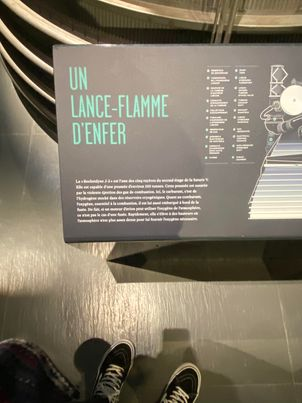
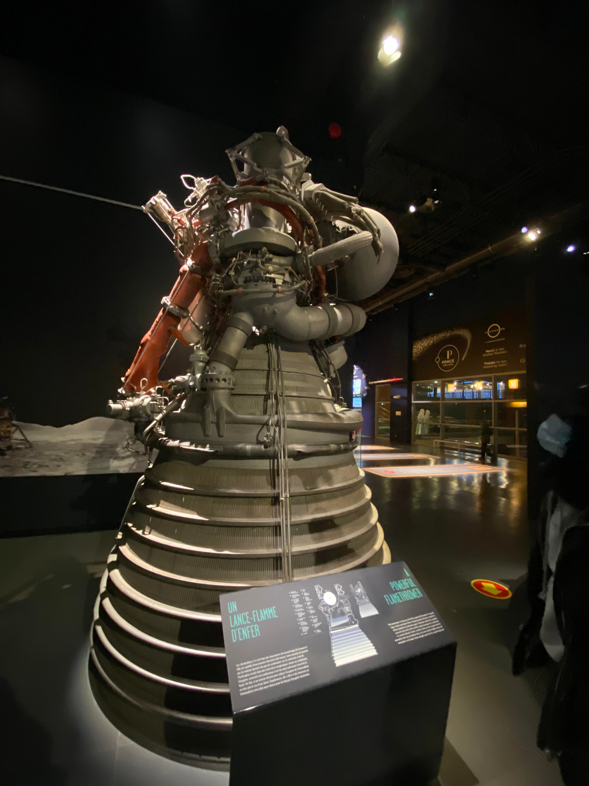

 ### Titre de l'oeuvre ou de la réalisation
 
 Rocketdyne J-2

 ### Nom de l'artiste ou de la firme
 
 Cosmodôme / MSFC/Rocketdyne

 ### Année de réalisation
 
 * 1959 - premier design
 * 26 Février 1966 - premier vole
 * 15 Juillet 1975 - dernier vole
 
 ### Nom de l'exposition ou de l'événement
 
 UN LANCE-FLAMME D'ENFER

 ### Lieu de mise en exposition
 
 Cosmodôme

 ### Date de votre visite
 
 18 avril 2021

 ### Description de l'oeuvre ou du dispositif multimédia 
 
 

 ### Explications sur la mise en espace de l'oeuvre ou du dispositif (texte à composer)
 
 L'oeuvre que j'ai choisis est assez grosse, elle prenait donc beaucoup de place dans l'exposition et était très facile à repéré a travers toutes les autres oeuvres. On peut voir touts les files qui dépassait et les engins qui ressortait.
  

 ### Liste des composantes et techniques de l'oeuvre ou du dispositif 
 
 * projecteur de lumière

 ### Liste des éléments nécessaires pour la mise en exposition (ex. : crochets, sac de sable, câbles de soutien...)

 ### Expérience vécue :
 
 J'ai beaucoup aimer aller visiter cette oeuvre puisque l'ambiance était très calme et relaxante. Il n'y avait pas beaucoup de personnes qui visitais quand j'y suis aller, donc j'avais vraiment l'espaces tout à moi pour bien apprécier les différentes oeuvres. Après réflexion j'ai choisis ''LE LANCE-FLAMME D'ENFER'' puisqu'il ma vraiment tapper dans l'oeil. Le titre aussi est très interrogateur sur qu'elle type de machine c'est. De plus, 

 ### Description de votre expérience de l'oeuvre ou du dispositif, de l'interactivité, des gestes à poser, etc.

 ❤️ Ce qui vous a plu, vous a donné des idées et justifications
 
 Ce qui ma plus est principalement la grandeure de l'oeuvre parce que cela me fut réaliser à quelle point les choses sont plus grandes que nous le pensont. En plus ce  nous fais rappeler à quelle point nous sommes insignifiant comparer à tout l'univers.

 🤔 Aspect que vous ne souhaiteriez pas retenir pour vos propres créations ou que vous feriez autrement et justifications

 Les aspects que je n'ai pas tant aprrécier, c'est qu'il n'y avais pas de interractions avec la machines.

 Références

### Photographies et croquis à intégrer

 photographie de l'oeuvre ou du dispositif dans son ensemble
 photographies des composantes de l'oeuvre
 photographies des éléments nécessaires à sa mise en espace
 photographie du cartel ou du panneau explicatif
 autoportrait (photo) de vous avec l'oeuvre
 croquis de la mise en espace (choisir la vue la plus pertinente : plan ou élévation)
 possibilité d'intégrer de courts vidéos pour documenter les actions de l'oeuvre ou l'interactivité avec celle-ci
Organisation du repository
